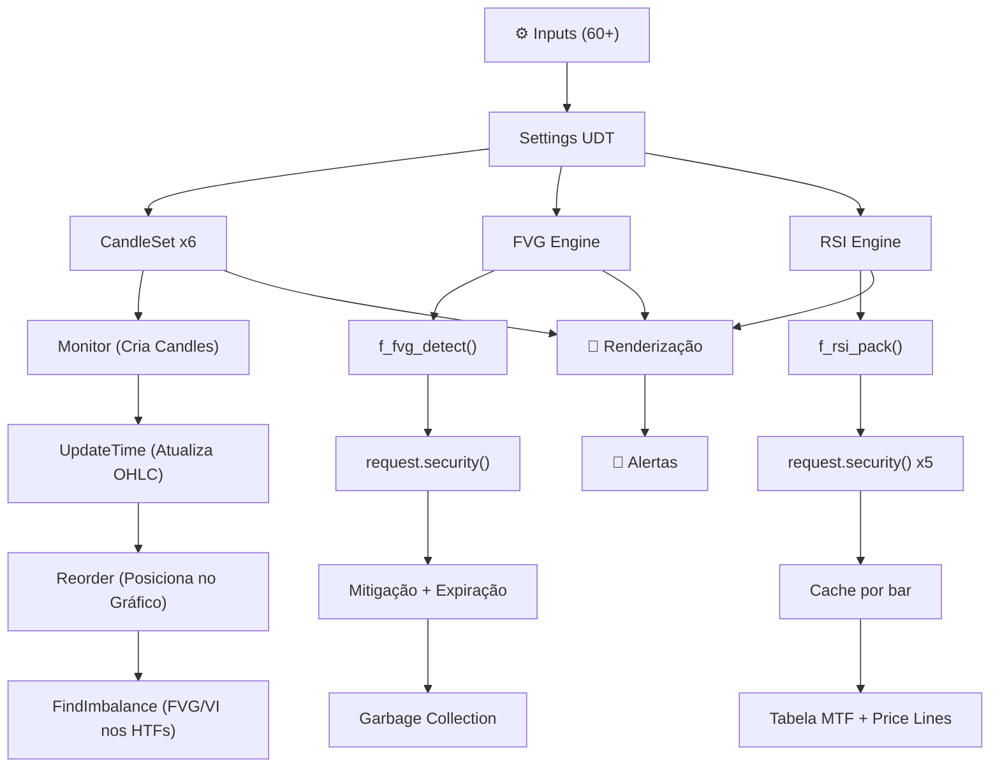

# 🏗️ Arquitetura: ICT + FVG + RSI v1.2.2

## Visão Geral

Indicador Pine Script v6 que combina 3 motores independentes de análise multi-timeframe.

| Módulo | Função | Complexidade |
| :--- | :--- | :--- |
| **ICT HTF Candles** | Renderiza candles de até 6 timeframes superiores ao lado do gráfico | 🔴 Alta |
| **FVG (Fair Value Gap)** | Detecta e gerencia gaps no gráfico principal com mitigação automática | 🟡 Média-Alta |
| **RSI Multi-TF** | Tabela RSI com cálculo reverso de preço-alvo por nível | 🟡 Média |

## Mapa de Fluxo

## Scorecard Técnico

| Critério | Nota | Observação |
| :--- | :---: | :--- |
| **Anti-Repaint** | 9/10 | `isconfirmed` + `lookahead_off` consistentes |
| **Performance** | 8/10 | `var`, dirty flags, restrição de Reorder |
| **Arquitetura** | 9/10 | UDTs, métodos encadeados, separação clara |
| **UX/Config** | 10/10 | Tooltips em tudo, Debug Mode, Dracula theme |
| **Manutenibilidade** | 8/10 | Changelog detalhado e versionado |
| **Segurança (Trading)** | 8/10 | Clamps, ATR threshold, divisão por zero |
| **GERAL** | ⭐ 8.7/10 | Indicador de nível profissional |

## Proteções Anti-Repaint

- `barstate.isconfirmed` para criação de candles e mitigação de FVGs
- `barmerge.lookahead_off` em todos os `request.security()`
- `Monitor` cria candles apenas em barras confirmadas ou históricas
- Alertas baseados em `g_prev_fvg_time` (snapshot antes da adição)

## Types (UDT)

| Type | Responsabilidade |
| :--- | :--- |
| `Candle` | Dados OHLC + objetos visuais (box, lines, label) |
| `FVG` | Gap com estado de mitigação e expiração |
| `Imbalance` | FVG/VI detectado nos candles HTF |
| `Settings` | Configurações globais de estilo e comportamento |
| `CandleSettings` | Configurações por timeframe (show, htf, max_display) |
| `CandleSet` | Agrupa candles + imbalances + labels por timeframe |
| `Trace` | Linhas OHLC conectando gráfico aos HTF candles |
